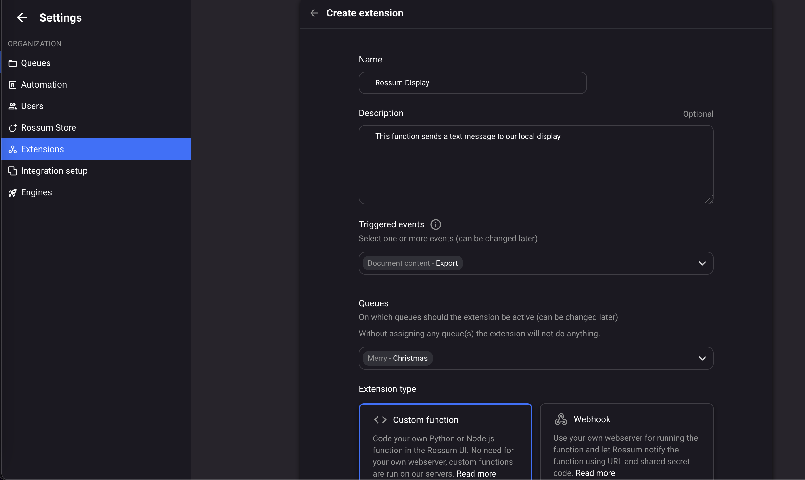
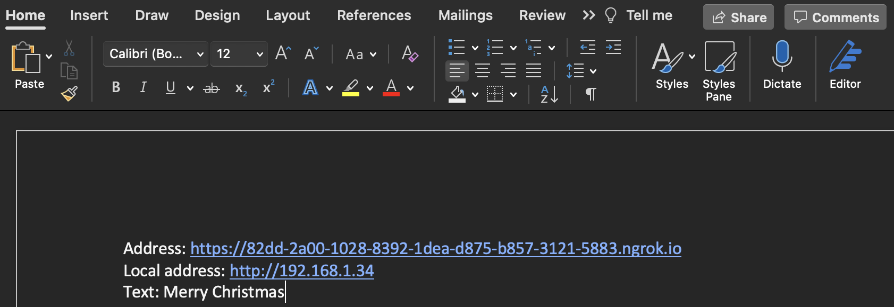
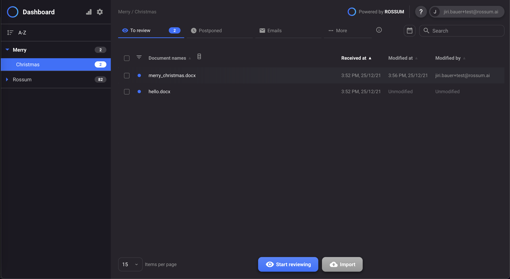
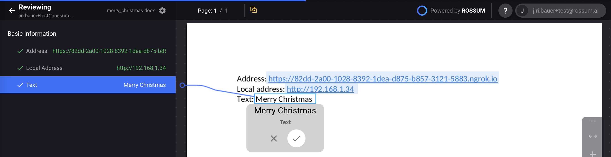

# Merry christmas from [Rossum](https://rossum.ai)!

This simple project demonstrates how Rossum can be used not only as a data extraction tool but also as an integration between various tools and technologies.

We want to prepare a simple document, which Rossum should be able to extract message from, and send to our home displaying device using its awesome [hook mechanism](https://rossum.ai/help/article/customize-rossum-logic-with-serverless-function/).

<figure class="video_container">
  <iframe src="https://youtu.be/HoGEXh1oYnA" frameborder="0" allowfullscreen="true"> </iframe>
</figure>

## Overview
We're gonna build a simple stack using a various option of technologies
- [Wemos D1 mini](https://tasmota.github.io/docs/devices/Wemos-D1-Mini/) as a server displaying message to a display
- [SSD1306 OLED display](https://www.amazon.com/SSD1306/s?k=SSD1306) to display our message
- [fast-api](https://fastapi.tiangolo.com) server as a bridge between ngrok and our local display
- [ngrok](https://ngrok.com) to be able to access our local server from the internet
- [Rossum](https://rossum.ai) to extract data from `.docx` file (yes, Rossum is able to process MS Word and Excel documents as well :rocket:) and call display message on our display using its amazing hook functions

## How to
### Wemos D1 mini
First we need to prepare our esp-8266 to be able to display our message.
- we will need a [Wemos D1 mini](https://shop.rasp.io/products/wemos-d1-mini-esp8266?variant=3485595336727) board and a [SSD1306 OLED display](https://cdn-shop.adafruit.com/datasheets/SSD1306.pdf)
- we need to flash micropython firmware to our wemos d1 mini (more [here](https://randomnerdtutorials.com/flashing-micropython-firmware-esptool-py-esp32-esp8266/))
- download the newest firmware [here](https://micropython.org/download/esp8266/)
- install `esptool`

    ``python3 -m pip install esptool``
- erase flash of your d1 mini

    ``esptool.py --chip esp8266 erase_flash``
- install the latest firmware

    ``esptool.py --port /dev/cu.usbserial-110 --baud 460800 write_flash --flash_size=detect 0 esp8266-20210902-v1.17.bin``
- connection

| Wemos D1 mini | SSD1306 |
|---------------|---------|
| GND           | GND     |
| VCC           | 5V      |
| SCL           | D1      |
| SDA           | D2      |

- we need to prepare a configuration file `wemos_display/configuration.py` based on [configuration file](./wemos_display/configuration_template.py)
    - if you're using the same display - SSD1306 it should contain (with `WIFI_CREDENTIALS` filled based on your configuration)
    ```python
    WIFI_CREDENTIALS = {
        "ssid": "...",
        "password": "...",
        "hostname": "RossumDisplay",
    }
    
    I2C_PINS = {
        "sda": 4,  # D2
        "scl": 5,  # D1
    }
    
    DISPLAY_RESOLUTION = (128, 64)
    ```
- [boot.py](./wemos_display/boot.py) is run on d1 startup and creates local Wi-Fi connection
- [display.py](./wemos_display/display.py) is a simple module handling our display
- [main.py](./wemos_display/main.py) defines a simple http server listening on `80` port for any `http GET` request with `?text=...` in its path
- the simplest way how to load `.py` files to d1 mini is using [PyCharm's micropython plugin](https://blog.jetbrains.com/pycharm/2018/01/micropython-plugin-for-pycharm/)

### Fast-Api local server
Since most of people does not have a private IP we need to create another http server that will be made public using [ngrok.com](https://ngrok.com) and will simply call our d1 mini
- [requirements.txt](./simple_server/requirements.txt) defines the only two dependencies our simple server has (`fastapi` and `uvicorn`)
- [main.py](./simple_server/main.py) defines a light-weight [Fast-API](https://fastapi.tiangolo.com) server that accepts `HTTP POST` request and converts it to `HTTP GET` request sent to out d1 mini
- to start the server simply run
    ```
    python3 -m pip install -r requirements.txt
    uvicorn main:app --reload
    ```

### Ngrok to make our FastApi server public
- download [ngrok](https://ngrok.com/download)
- run `ngrok http 8000` to make our fast-api app public (make note of the displayed URL - in our case `https://82dd-2a00-1028-8392-1dea-d875-b857-3121-5883.ngrok.io`)

### Prepare Rossum python function extension
- visit [rossum-elis](https://elis.rossum.ai)
- update queue schema according to [schema.json](./static/schema.json) (it creates 3 string fields: `address` (url of our ngrok server), `local_address` (local address of our d1 mini server), `text` (text message to display on our display))
- create function extension  attached to the queue with updated schema
- update function code according to [function.py](./static/function.py)

### Prepare MS Word document
- create a `merry_christmas.docx` file with follow ing fields
  - address (url of our ngrok server)
  - local address (local address of our d1 mini server)
  - text (text message to display on our display)
  

### Let the magic happen in Rossum
- upload the MS Word file to your Rossum queue 
- click on your christmas annotation
- make sure the bounding boxes covers your texts 
- click on Confirm button 